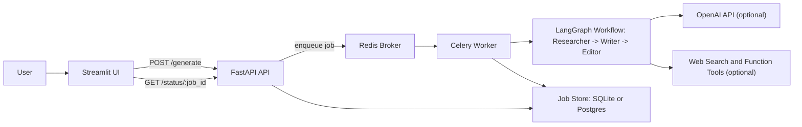

# Research to Blog System

Research to Blog System is a multi-agent content pipeline that turns a topic
into structured research notes, a draft, and editorial feedback. It includes a
local developer workflow, a Dockerized stack for runtime parity, and cloud
deployment automation for AWS.

This repository is designed to show how to move a multi-agent system from
localhost experimentation to a production-style cloud deployment with clear
contracts, reproducible infrastructure, and scalable runtime components.

## What This Project Showcases
- How to design a multi-agent workflow with explicit roles and guardrails.
- How to expose that workflow behind an async API + background worker pattern.
- How to test behavior and reliability locally before cloud rollout.
- How to keep local and cloud topology aligned (API, worker, queue, database,
  UI).
- How to deploy and operate the same system on AWS using Terraform, ECS, and
  managed services.

## Example Use Cases
- Generate a blog draft from a topic with grounded research notes.
- Produce different content variants (for example, professional article vs.
  short social post) by changing tone/length/context controls.
- Run mock mode for fast development loops, then switch to OpenAI mode for
  realistic output.
- Demonstrate a full system design interview/project:
  local prototype -> containerized runtime -> cloud deployment.

## System Diagram



## What You Get
- Multi-agent workflow (`Researcher -> Writer -> Editor`) with deterministic
  revision guardrails and escalation.
- Async job API with lifecycle polling:
  `POST /generate` and `GET /status/{job_id}`.
- Worker-based background execution with retries.
- Streamlit UI for submissions, status tracking, and copy-friendly outputs.
- Optional OpenAI execution mode plus mock mode for fast test loops.
- Docker Compose stack with Redis and Postgres for local parity.
- Terraform-based AWS deployment (ECS/Fargate, ALB, Route53, ACM, Cognito,
  WAF, Secrets Manager, RDS, ElastiCache, ECR).
- CI workflow for build/plan on PRs and controlled deploy workflows.

## Prerequisites
- Python `3.11+`
- `uv`
- Docker Desktop (for container workflow)
- AWS CLI + Terraform (for cloud workflow)

Command discovery:
```bash
make
# or
make help
```

## Quick Start (Local)
1. Install dependencies:
```bash
make sync
```
2. Create local env file:
```bash
cp .env.example .env
```
3. Run quality checks:
```bash
make lint
make test
```
4. Run API + worker:
```bash
make run-api
make run-worker
```
5. Run UI (new terminal):
```bash
make run-ui
```

Default local URLs:
- API: `http://127.0.0.1:8000`
- UI: `http://127.0.0.1:8501`

## Local Docker Stack
Use Docker when you want local behavior close to cloud runtime.

```bash
make docker-up
make docker-ps
make docker-smoke
make docker-smoke-db
make docker-smoke-openai
make test-gate
make docker-down
```

Notes:
- `make docker-smoke`: validates async enqueue + status lifecycle.
- `make docker-smoke-db`: validates persisted `jobs` row/state in Postgres.
- `make docker-smoke-openai`: validates end-to-end OpenAI mode in containers.
- `make test-gate`: runs strict API readiness checks and enqueue latency tests.

## LLM Modes and Research Controls
Global runtime modes:
- Mock mode: `USE_MOCK_LLM=true`
- OpenAI mode: `USE_MOCK_LLM=false` with `OPENAI_API_KEY`

Optional safety lock:
- `MOCK_MODE_STRICT=true` forces mock-only behavior.

Researcher controls:
- `RESEARCH_WEB_SEARCH_ENABLED=true`
- `RESEARCH_FUNCTION_TOOLS_ENABLED=true`

In the UI, each request can also set:
- LLM mode (`Mock LLM` or `OpenAI LLM`)
- Max sources
- Content type/context
- Tone
- Length preference
- Research depth

## API Contract (High Level)
- `POST /generate`
  - accepts topic and content controls
  - returns quickly with job metadata (`job_id`, `PENDING`)
- `GET /status/{job_id}`
  - returns lifecycle status and artifacts (`research_notes`, `draft`,
    `editor_feedback`, etc.)
  - stable under repeated polling

Standard error behavior is implemented for:
- validation failures (`422`)
- missing jobs (`404`)
- queue unavailable (`503`)
- unexpected failures (`500` with traceable metadata)

## Cloud Deployment (AWS)
1. Bootstrap variables:
```bash
cp infra/terraform/envs/dev/terraform.tfvars.example \
  infra/terraform/envs/dev/terraform.tfvars
```
2. Initialize and validate:
```bash
make tf-init-dev
make tf-validate-dev
make tf-plan-dev
```
3. Optional manual apply:
```bash
make tf-apply-dev
```

Image/deploy workflow via Makefile wrappers:
```bash
IMAGE_TAG=$(git rev-parse --short HEAD) make image-build-dev
IMAGE_TAG=$(git rev-parse --short HEAD) make image-push-dev
IMAGE_TAG=$(git rev-parse --short HEAD) make deploy-plan-dev
IMAGE_TAG=$(git rev-parse --short HEAD) make deploy-dev
```

See:
- `infra/terraform/README.md`
- `infra/terraform/authentication_runbook.md`

## CI/CD Behavior
Workflow file:
- `.github/workflows/build-and-push-images.yml`

Behavior:
- PRs to `main`: build + Terraform plan validation.
- Non-`main` pushes: build + plan by default.
- `main` pushes: full deploy path (build/push/apply/stabilize/smoke).
- Optional feature-branch deploy override is supported via environment vars.

Validation guide:
- `docs/ci_validation_runbook.md`

## Security and Secrets
- Never commit `.env`, `terraform.tfvars`, or real secret values.
- Use `.env.example` as template only.
- Cloud secrets (OpenAI key, API auth key, DB credentials) should come from
  AWS Secrets Manager.
- Rotate API shared key with:
```bash
make rotate-api-auth-key-dev
```
- Review `.gitignore` before commits and keep secret scans in your release
  checklist.
