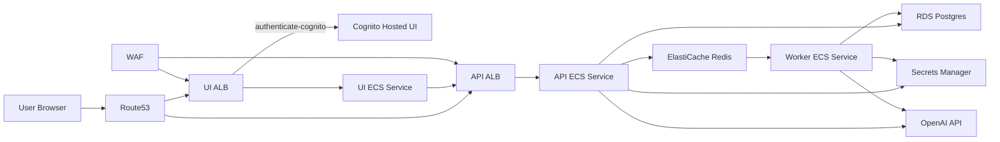

# Terraform Deployment Guide

This directory contains the AWS infrastructure definition for the
Research-to-Blog system.

## Cloud System Diagram



## Layout

- `envs/dev`: environment root module and backend config.
- `envs/observability-dev`: separate Langfuse cloud stack (own state key).
- `modules/network`: VPC, subnets, routing.
- `modules/security`: security groups and ECS IAM roles.
- `modules/data`: RDS Postgres and ElastiCache Redis.
- `modules/compute`: ECS/Fargate services and ALBs.
- `modules/secrets`: app Secrets Manager entries (OpenAI, API key, Langfuse).
- `modules/observability`: Langfuse ECS/ALB deployment module.
- `modules/observability_secrets`: Langfuse Secrets Manager entries.
- `modules/ecr`: ECR repositories for API, worker, and UI images.

## Backend (dev)

The `dev` environment is configured for S3 remote state with:

- Bucket: `vc-tfstate-deploy-dev`
- Key: `projects/vc-blog-agent/terraform/state/dev.tfstate`
- Profile: `personal-aws-dev`
- Locking: `use_lockfile = true`

Observability (`observability-dev`) uses a separate state key:

- Bucket: `vc-tfstate-deploy-dev`
- Key: `projects/vc-blog-agent/terraform/state/observability-dev.tfstate`
- Profile: `personal-aws-dev`
- Locking: `use_lockfile = true`

## Usage (dev)

From repository root:

```bash
make tf-init-dev
make tf-validate-dev
make tf-plan-dev
```

`make tf-init-dev`, `make tf-validate-dev`, and `make tf-plan-dev` do not
apply changes. Run `make tf-apply-dev` only after reviewing the plan.

Image tag handling for dev commands:
- `make deploy-plan-dev`, `make deploy-dev`, `make tf-plan-dev`, and
  `make tf-apply-dev` pass `-var=image_tag=$(IMAGE_TAG)`.
- `IMAGE_TAG` defaults to the current git commit SHA (12 chars) to mirror CI.
- `infra/terraform/envs/dev/terraform.tfvars` can keep `image_tag = "latest"`
  as a fallback; command-line `-var` values take precedence.
- Override manually only when needed, for example:
  `IMAGE_TAG=<tag> make deploy-dev`.

Observability stack commands:

```bash
make tf-init-obs-dev
make tf-validate-obs-dev
make tf-plan-obs-dev
```

Apply with:

```bash
make tf-apply-obs-dev
```

## Hostname Configuration

By default, API/UI hostnames are derived from:
- `route53_zone_name`
- `app_dns_prefix`
- `api_dns_label`
- `ui_dns_label`

Derived patterns:
- API: `<api_dns_label>.<app_dns_prefix>.<route53_zone_name>`
- UI: `<ui_dns_label>.<app_dns_prefix>.<route53_zone_name>`

Example:
- `route53_zone_name = "dev.vc-projects-ds.com"`
- `app_dns_prefix = "blog-agent"`
- Results:
  - `api.blog-agent.dev.vc-projects-ds.com`
  - `ui.blog-agent.dev.vc-projects-ds.com`

If needed, you can still set full hostname overrides via
`api_hostname` and `ui_hostname`.

## Cloud Portability Notes

- ECS services run in private subnets with `assign_public_ip = false`.
- Public ALBs terminate ingress and route to ECS targets in private subnets.
- NAT gateway is enabled by default for private egress (ECR pulls,
  OpenAI API calls, CloudWatch logs, etc.).
- HTTPS is enabled by default with ACM DNS validation and Route53 alias
  records for API/UI hostnames.
- UI ALB uses Cognito hosted login (`authenticate-cognito`) for access
  control at the edge.
- API shared-key auth can be enabled with `api_auth_enabled=true`.
  The API key is stored in Secrets Manager and injected into API/UI tasks.
- RDS now uses AWS-managed master credentials
  (`manage_master_user_password = true`), with the generated secret ARN
  exposed as `db_master_secret_arn`.
- A regional WAF is associated with both ALBs (managed rules + rate limit).
- If `api_image`, `worker_image`, and `ui_image` are empty, Terraform
  composes image URIs from created ECR repositories and `image_tag`.

## Database Secret Migration Note

For older stacks that previously used plaintext `db_password`, run apply twice
during migration:
1. First apply enables `manage_master_user_password` on RDS.
2. Second apply wires ECS DB secret injection and IAM access using the now
   available RDS secret ARN.

## CI Image Pipeline

The workflow `.github/workflows/build-and-push-images.yml` builds and pushes
API/worker/UI images to ECR (`<project>-<env>-{api,worker,ui}`).

Tag behavior in CI:
- PR/non-main paths resolve `image_tag` to `${GITHUB_SHA::12}` and run
  build/plan validation.
- Main (and explicit feature deploy override) resolves `image_tag` to
  `${GITHUB_SHA::12}` and runs full deploy.
- Manual `workflow_dispatch` may pass an explicit `image_tag`; when omitted,
  release defaults are used.

Required GitHub Environment variables:
- `AWS_REGION`
- `AWS_ACCOUNT_ID`
- `PROJECT_NAME`
- `CLOUD_ENV`
- `TF_WORKDIR`
- `IMAGE_PLATFORM`

Optional GitHub Environment variables:
- `ENABLE_FEATURE_DEPLOY`
- `FEATURE_DEPLOY_REF`

Required GitHub Environment secrets:
- `AWS_ROLE_TO_ASSUME` (OIDC role)
- `API_AUTH_KEY`
- `OPENAI_API_KEY`

Optional GitHub Environment secret:
- `AWS_ROLE_EXTERNAL_ID`
- `LANGFUSE_PUBLIC_KEY` (if app tracing to Langfuse is enabled)
- `LANGFUSE_SECRET_KEY` (if app tracing to Langfuse is enabled)

## Authentication Operations

User onboarding, disable/enable, and access control steps are documented in:

- `infra/terraform/authentication_runbook.md`

Langfuse deployment and secrets bootstrap are documented in:

- `infra/terraform/langfuse_deployment_runbook.md`

## One-Command Bootstrap (Recommended)

Use the bootstrap script to reduce manual setup drift across AWS Secrets
Manager, GitHub Environment values, and Terraform tfvars files.

1. Copy and fill the template:

```bash
cp ops/dev.bootstrap.env.example ops/dev.bootstrap.env
```

2. Dry-run the full workflow:

```bash
make bootstrap-dev-dry-run
```

3. Apply configuration sync:

```bash
make bootstrap-dev
```

4. Plan or apply both stacks in sequence (`observability-dev` then `dev`):

```bash
make bootstrap-dev-plan
make bootstrap-dev-apply
```
